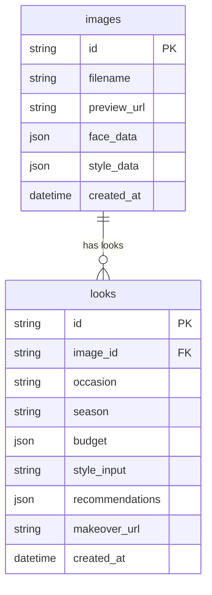

# ARCHITECTURE.md
## StyleMirror AI — System Architecture & Design Document

---

## 1. High-Level Architecture

```
┌─────────────────────────────────────────────────────────────────────┐
│                          USER BROWSER                               │
│                       React + Vite (SPA)                            │
│   Pages: Home │ Upload │ Preferences │ Recommendations │ Report │ Chat│
└────────────────────────────┬────────────────────────────────────────┘
                             │ HTTPS REST (Axios with Retries)
                             ▼
┌─────────────────────────────────────────────────────────────────────┐
│                      FASTAPI BACKEND                                │
│                    Python 3.10+ — Port 8000                         │
│                                                                     │
│  /api/v1/analyze             /api/v1/recommend                      │
│  /api/v1/makeover            /api/v1/chat                           │
│  /api/v1/report/data/{id}    /api/v1/report/pdf/{id}                │
│  /api/v1/camera/capture                                             │
└──────────┬─────────────────┬──────────────────┬────────────────────┘
           │                 │                  │
     ┌─────▼──────┐   ┌──────▼──────┐   ┌──────▼──────────┐
     │ AI PIPELINE│   │  DB LAYER   │   │  IMAGE STORAGE  │
     │  Modules   │   │  SQLite /   │   │  Local FS       │
     │            │   │  SQLAlchemy │   │  /uploads/      │
     └─────┬──────┘   └─────────────┘   └─────────────────┘
           │
     ┌─────▼──────────────────────────────────────────────┐
     │               EXTERNAL AI SERVICES                 │
     │                                                    │
     │  OpenAI GPT-4o ──── Fashion recommendations        │
     │  Gemini Flash ───── Aesthetic analysis + Chat       │
     │  Imagen 3 ───────── Makeover image generation      │
     │  MediaPipe ──────── Face mesh (local geometry)     │
     └────────────────────────────────────────────────────┘
```

---

## 2. AI Pipeline — Detailed Flow

The StyleMirror AI system operates through six core pipeline stages:

```
USER UPLOADS PORTRAIT
       │
       ▼
┌──────────────────────────────────────────────────┐
│  STAGE 1: FACE ANALYSIS (Local — MediaPipe)      │
│  • Face detection and 468-point face mesh        │
│  • Face shape classification (Oval, Round, etc.) │
│  • Hair type estimation (texture + color)        │
│  Output: face_data JSON                          │
└──────────────────┬───────────────────────────────┘
                   │
                   ▼
┌──────────────────────────────────────────────────┐
│  STAGE 2: STYLE ANALYSIS (Gemini Vision API)     │
│  • Current clothing style detection              │
│  • Current fashion score (0–10 baseline)         │
│  • Skin tone extraction (K-Means on face region) │
│  Output: style_data JSON                         │
└──────────────────┬───────────────────────────────┘
                   │
                   ▼
┌──────────────────────────────────────────────────┐
│  STAGE 3: PREFERENCE ELICITATION (User Input)    │
│  • Occasion (e.g. Wedding, Interview, Casual)    │
│  • Season (Summer, Winter, Monsoon)              │
│  • Budget (₹1000, ₹3000, ₹5000, ₹10000)          │
│  • Style preferences & custom text input         │
└──────────────────┬───────────────────────────────┘
                   │
                   ▼
┌──────────────────────────────────────────────────┐
│  STAGE 4: RECOMMENDATION ENGINE (GPT-4o/Gemini)  │
│  Inputs: Face analysis + Style analysis + Prefs  │
│  Generates:                                      │
│  • Outfit Set (Tops, Bottoms, Footwear)          │
│  • Recommended Hairstyles                        │
│  • Accessories (Watch, Belt, Glasses)            │
│  • Grooming & Makeup coordinates                 │
│  • Color Palette (Best colors vs Colors to avoid)│
│  Output: recommendations JSON                    │
└──────────────────┬───────────────────────────────┘
                   │
                   ▼
┌──────────────────────────────────────────────────┐
│  STAGE 5: MAKEOVER GENERATION                    │
│  (Google Imagen 3 / CV2 Warm Glow Fallback)      │
│  • Prompts conditioned on recommendations        │
│  • Local OpenCV warm glow filter fallback        │
│  Output: makeover_url String                     │
└──────────────────┬───────────────────────────────┘
                   │
                   ▼
┌──────────────────────────────────────────────────┐
│  STAGE 6: STYLE REPORT GENERATION (ReportLab)    │
│  • Compiles complete coordinates report          │
│  • Generates visual PDF saved on disk            │
│  Output: PDF File Response                       │
└──────────────────────────────────────────────────┘
```

---

## 3. Identity Preservation & Evaluation Framework

As a research-driven project (Phase 7), verification of identity preservation is vital. We utilize a three-layered approach:

### Layer 1 — Natural Language Grounding
The generation prompt is anchored using natural language extracted from the face shape and skin tone analysis (e.g. *"Same person, oval face, medium skin tone"*), prompting the generative model to align with the subject's base features.

### Layer 2 — Local Fallback Mechanics
If no API connection is available, an OpenCV-based soft warm glow filter is applied in [makeover.py](file:///c:/Users/hp/mirrorai/backend/ai/makeover.py) to preserve 100% of facial identity while showcasing subtle style enhancements.

### Layer 3 — Quantitative Evaluation Loop
The research evaluation framework in the `research/` directory runs automated checks on generated makeover outputs:
* **Identity Preservation Score**: Cosine similarity of face embeddings in [arcface_score.py](file:///c:/Users/hp/mirrorai/backend/metrics/arcface_score.py) using InsightFace, falling back to a normalized MediaPipe landmark geometry vector distance.
* **Style Adherence Score**: Evaluated in [clip_score.py](file:///c:/Users/hp/mirrorai/backend/metrics/clip_score.py) using CLIP ViT-B/32 or local HSV color mask and keyword matching.
* **Perceptual Quality**: Evaluated in [lpips_score.py](file:///c:/Users/hp/mirrorai/backend/metrics/lpips_score.py) using LPIPS models or a structural similarity (SSIM) + L2 pixel distance fallback.

---

## 4. API Endpoints

The FastAPI endpoints are modularized in the [backend/app/api/](file:///c:/Users/hp/mirrorai/backend/app/api/) directory:

| Endpoint | Method | Source File | Description |
|---|---|---|---|
| `/api/v1/analyze` | `POST` | [analyze.py](file:///c:/Users/hp/mirrorai/backend/app/api/analyze.py) | Uploads portrait and returns face shape, hair type, skin tone, current style, and fashion score. |
| `/api/v1/recommend` | `POST` | [recommend.py](file:///c:/Users/hp/mirrorai/backend/app/api/recommend.py) | Takes image ID and user preferences to generate clothing and styling suggestions. |
| `/api/v1/makeover` | `POST` | [makeover.py](file:///c:/Users/hp/mirrorai/backend/app/api/makeover.py) | Triggers Imagen 3 makeover generation or CV2 warm glow filter fallback. |
| `/api/v1/chat` | `POST` | [chat.py](file:///c:/Users/hp/mirrorai/backend/app/api/chat.py) | Context-aware style consultant chatbot using Gemini 2.0 Flash. |
| `/api/v1/report/data/{image_id}` | `GET` | [report.py](file:///c:/Users/hp/mirrorai/backend/app/api/report.py) | Retrieves the metadata and styling coordinates JSON. |
| `/api/v1/report/pdf/{image_id}` | `GET` | [report.py](file:///c:/Users/hp/mirrorai/backend/app/api/report.py) | Compiles and streams the ReportLab PDF styling report. |
| `/api/v1/camera/capture` | `POST` | [camera.py](file:///c:/Users/hp/mirrorai/backend/app/api/camera.py) | Captures frame via local webcam, runs analysis pipelines, and returns results. |

---

## 5. Database Schema

The database utilizes **SQLite** for lightweight local storage. SQLAlchemy configurations are in [backend/database/](file:///c:/Users/hp/mirrorai/backend/database/).



### Table Definitions

1. **`images`** ([models/image.py](file:///c:/Users/hp/mirrorai/backend/database/models/image.py))
   - `id` (String, PK): Unique UUID.
   - `filename` (String): Saved portrait file name.
   - `preview_url` (String): Endpoint path to serve the image.
   - `face_data` (JSON): Facial shape classification, hair type, bounding box, and landmark descriptors.
   - `style_data` (JSON): Extracted skin tone category, current clothing aesthetic, baseline fashion score, and feedback lists.
   - `created_at` (DateTime): Record creation timestamp.

2. **`looks`** ([models/look.py](file:///c:/Users/hp/mirrorai/backend/database/models/look.py))
   - `id` (String, PK): Unique UUID.
   - `image_id` (String, FK): Reference to the original image record.
   - `occasion` (String): Target occasion (Wedding, Interview, etc.).
   - `season` (String): Target season (Summer, Winter, Monsoon).
   - `budget` (JSON): Budget constraints.
   - `style_input` (String): User's custom styling notes.
   - `recommendations` (JSON): Generated outfit details, hairstyles, accessories, makeup coordinates, and color palette suggestions.
   - `makeover_url` (String): URL of the final generative makeover image.
   - `created_at` (DateTime): Timestamp of recommendation.

> [!NOTE]
> Database models for users, chat histories, or report models ([user.py](file:///c:/Users/hp/mirrorai/backend/database/models/user.py), [chat_history.py](file:///c:/Users/hp/mirrorai/backend/database/models/chat_history.py), [report.py](file:///c:/Users/hp/mirrorai/backend/database/models/report.py)) exist as empty/placeholder modules reserved for future authentication and logging features.

---

## 6. Frontend Page Architecture

The client single-page application is built on **React (Vite)** and routed in [App.jsx](file:///c:/Users/hp/mirrorai/frontend/src/App.jsx):

```
App (React Router v6)
├── /                          → HomePage
├── /upload                    → UploadPage
├── /preferences               → PreferencesPage
├── /recommendations           → RecommendationsPage
├── /report                    → StyleReportPage
├── /chat                      → FashionChatPage
└── /gallery                   → SavedLooksGallery (Placeholder)
```

---

## 7. State Management (Zustand)

Global frontend state is managed via persistent Zustand stores located in [frontend/src/store/](file:///c:/Users/hp/mirrorai/frontend/src/store/):

* **`useImageStore`** ([useImageStore.js](file:///c:/Users/hp/mirrorai/frontend/src/store/useImageStore.js))
  Manages uploaded raw images, portrait preview URLs, face shape, hair type, skin tone, current style, and baseline fashion score.
* **`useRecommendationStore`** ([useRecommendationStore.js](file:///c:/Users/hp/mirrorai/frontend/src/store/useRecommendationStore.js))
  Stores output from the consolidated recommend engine including outfits, hairstyles, makeup parameters, accessories, and color palette.
* **`useAppStore`** ([useAppStore.js](file:///c:/Users/hp/mirrorai/frontend/src/store/useAppStore.js))
  Coordinates global UI states, loader rings, and error messages.
* **`useChatStore`** ([useChatStore.js](file:///c:/Users/hp/mirrorai/frontend/src/store/useChatStore.js))
  Stores assistant conversations.
* **`useReportStore`** ([useReportStore.js](file:///c:/Users/hp/mirrorai/frontend/src/store/useReportStore.js))
  Manages styling coordinates compilation and PDF report streaming triggers.

---

## 8. Deployment & Environment Structure

```
┌─────────────────────────────────────────────────────────┐
│                    DEVELOPMENT / DEMO                   │
│                                                         │
│  localhost:5173  ──── Vite dev server (React client)   │
│  localhost:8000  ──── FastAPI backend server            │
│  SQLite File     ──── stylemirror.db (Root workspace)   │
│  Local Directory ──── /backend/uploads/ (Raw images)    │
│  Local Directory ──── /reports/pdf/ (Generated reports) │
└─────────────────────────────────────────────────────────┘
```

* **Image Server**: Uploaded images are stored locally under `backend/uploads/` and served via FastAPI `StaticFiles` mounting.
* **PDF Output**: Compiled reports are cached under `reports/pdf/` and cleaned periodically.
